# Kingmaker Tools (Unofficial)

This module ships macros, journal entries, roll tables, effect items, additional tooling for OGL/CUP licensed content from the Kingmaker Adventure Path for Pathfinder 2nd Edition.

Uses the [Open Gaming License](./OpenGameLicense.md) and [CUP](https://paizo.com/community/communityuse)

> This FoundryVTT module uses trademarks and/or copyrights owned by Paizo Inc., used under Paizo's Community Use Policy (paizo.com/communityuse). We are expressly prohibited from charging you to use or access this content. This FoundryVTT module is not published, endorsed, or specifically approved by Paizo. For more information about Paizo Inc. and Paizo products, visit paizo.com.

## Installation

The package is available through the [module registry](https://foundryvtt.com/packages/pf2e-kingmaker-tools)

You may want to enable the [FXMaster](https://github.com/ghost-fvtt/fxmaster) to display rain and snow effects depending on the current weather. 

### Git

Clone this repository into your installation's module folder:

    cd ~/.local/share/FoundryVTT/Data/modules
    git clone https://github.com/BernhardPosselt/pf2e-kingmaker-tools.git 
    yarn install
    yarn run build

Activate the module in FoundryVTT.

### Journals

The following journals are shipped:

* **Calendar**: lists weekday and month names
* **Camping** Activities: lists all camping activities linked to their respective effects
* **Hexploration**: hexploration rules from AoN enriched with effects and clarifications
* **Influence**: influence activities and a sheet to track points, weaknesses, resistances and biases of each NPC with an influence stat block
* **Recipes**: a list of recipes by level linked to their respective effects
* **Kingdom Activities**: All activities

### Macros

#### Camping Macros
**Hint**: All camping macros that are based on a region or region DC are configured using the drop-down of the random encounter macro!

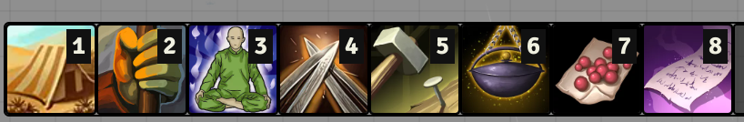

* **Subsist with -5 and Survival**: Even callable on the world map since the user's character is used instead of the selected token
* **Prepare Camp**: Posts results to chat
* **Camouflage Campsite**: Posts effects based on result to chat (only GM visible)
* **Hunt and Gather**: Adds the ingredients into your inventory based on the result
* **Organize Watch**: Posts effects based on result to chat
* **Cook Recipe**: Links the recipe to chat after a Survival or Cooking Lore check; list of recipes is determined by learned recipes done via **Recipes** macro. **Note**: does not consume rations nor ingredients!
 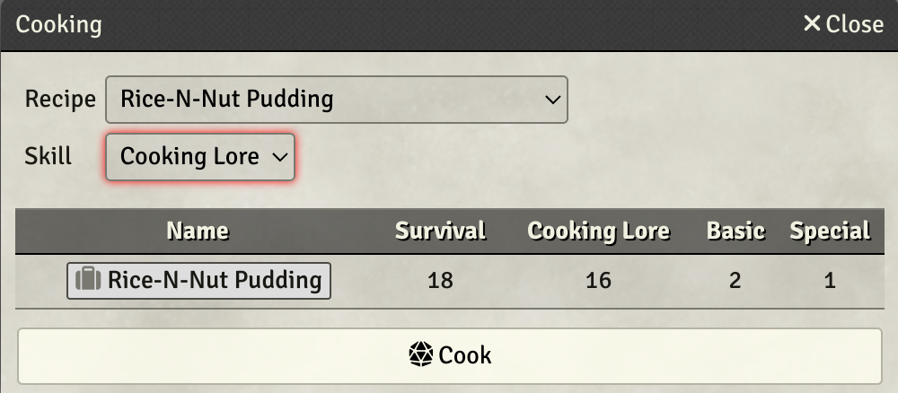
* **Tell Campfire Story**: Posts effects based on result to chat
* **Recipes**: A macro to learn or buy special recipes. You can also add homebrew recipes. The UUID of your item recipe can be found under its Rules tab: 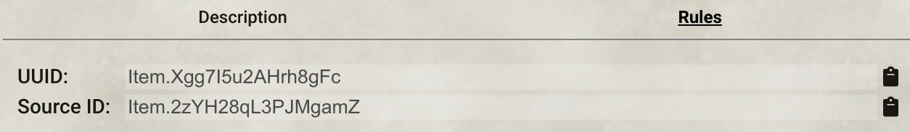 Note that the list of known recipes is stored on per-user basis due to limitations of the foundry permissions API, so recipe changes don't propagate to others. **Note**: Buying recipes does not subtract the required coins from your inventory!
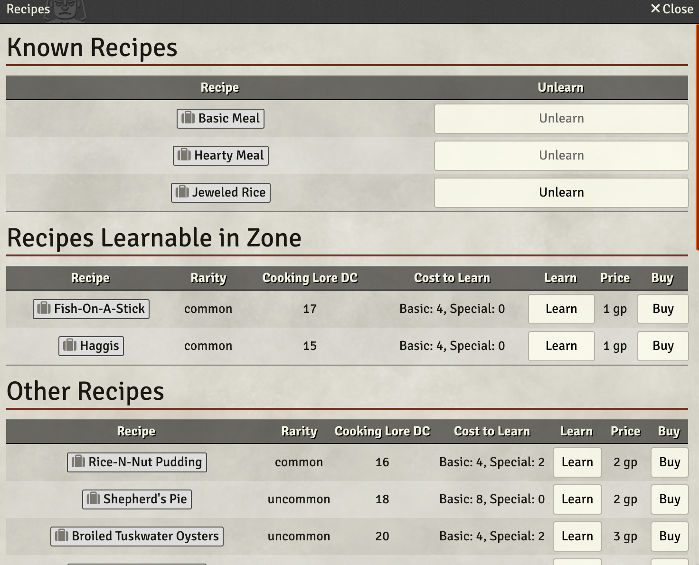
* **Learn from a Companion**: Posts result of check to chat
* **Camp Management**: Posts results of check to chat
* **Companion Effects to Chat**: Allows the GM to quickly post the drag and drop effects of actions of companions to chat

#### Other
* A macro to toggle weather on/off to change into non-exposed areas
* A macro to manually roll weather, should you prefer to not automatically roll it.
* A macro to advance/retract to a certain day of time
* A stopwatch macro to advance time during rest, daily preparations and tracks adventuring time after daily preps
* A macro to roll on a custom Kingdom Events table. By default, the Roll Table is called "Kingdom Events", but you can change the name in the settings
* 3 macros that help automate exploration mode. 
  
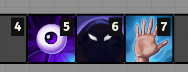
  
  2 of them integrate with [PF2E Exploration Effects](https://foundryvtt.com/packages/pf2e-exploration-effects) and will roll secret checks for stealth and perception for all characters on the current canvas, that have the "Search" or "Avoid Notice" exploration effect. The other macro rolls checks for all configured characters and can be used to roll checks on the hex map without having the tokens be active on that scene.


  
* A macro to roll a random encounter of a region.
  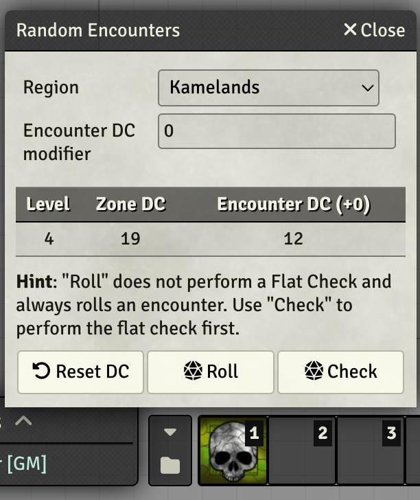
  
  Optionally, can be given a proxy roll table like the one listed in [The Hexploration](https://2e.aonprd.com/Rules.aspx?ID=1276) rules. If you do, the String value "Creature" indicates to roll on the region roll table. Leave the proxy table setting blank to roll on the region encounters directly

  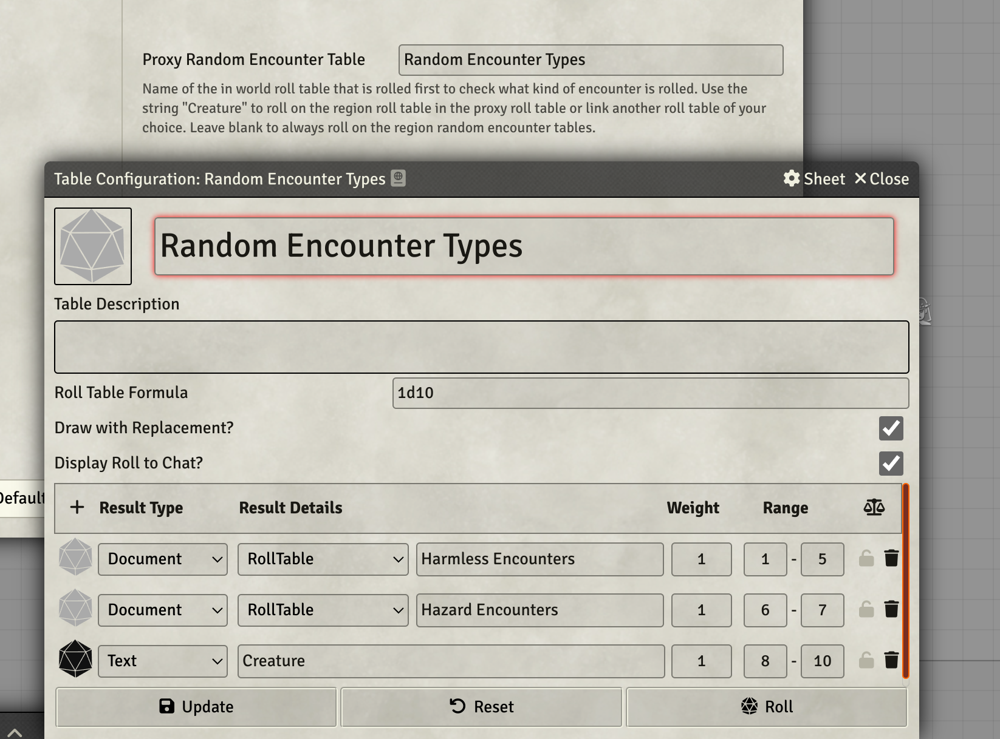

### Tokens

**Note**: This module does not and can not ship any art! You are responsible for placing the appropriate images in the described folder structure. See further down for how the folder needs to be organized.

The module ships with a settings to auto-configure all tokens from the adventure path by looking up files in a certain folder. If you don't want that, remove the following lines from the **module.json** file:

```json
"flags": {
  "pf2e-kingmaker-tools": {
    "pf2e-art": "modules/pf2e-kingmaker-tools/map.json"
  }
},
```

The tokens integrate with the [Token Pack](https://foundryvtt.com/packages/pf2e-tokens-bestiaries) and expect the other tokens to be placed into your **Data/pf2e-kingmaker-tools-tokens/** directory under the following paths:

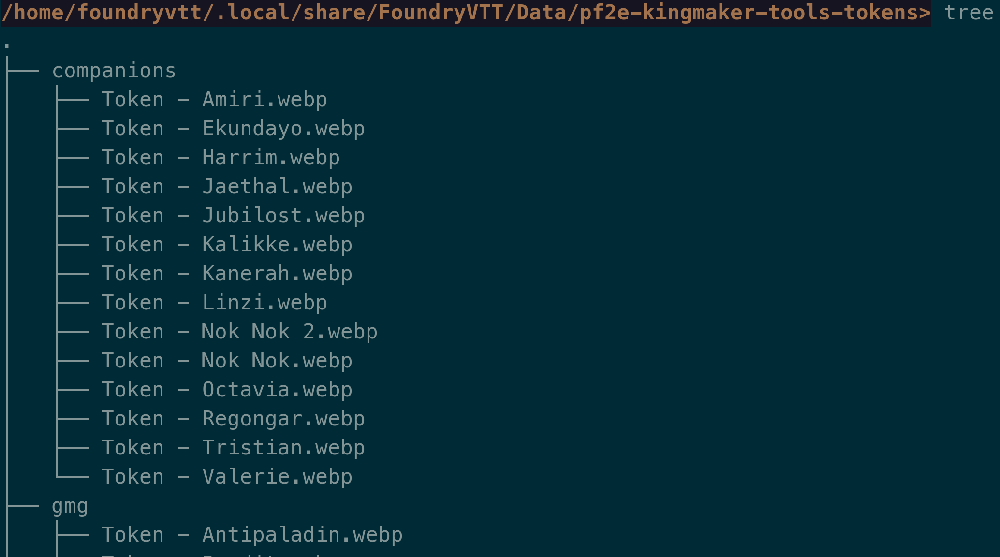

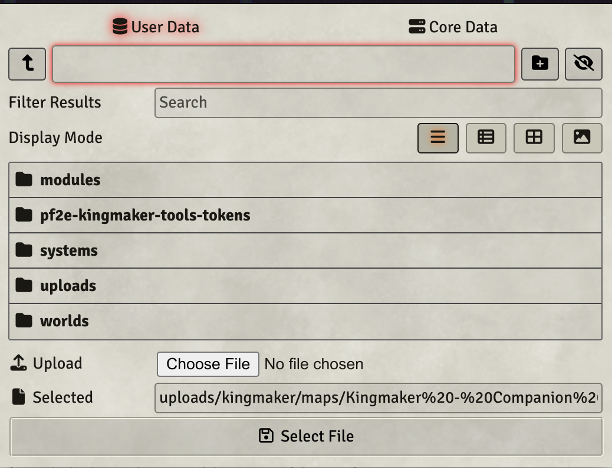

**The Forge**: If you are using The Forge, you need to place the folder in **My Asset Library** instead. If a file is not found under User Data, The Forge will instead try to look it up under the same path in **My Asset Library** instead.

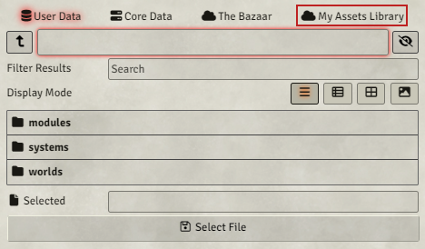

* **kingmaker/Token - Aecora Silverfire.webp**
* **kingmaker/Token - Agai.webp**
* **kingmaker/Token - Akiros.webp**
* **kingmaker/Token - Akuzhail.webp**
* **kingmaker/Token - Alasen.webp**
* **kingmaker/Token - Ameon Trask.webp**
* **kingmaker/Token - Annamede Belavarah.webp**
* **kingmaker/Token - Armag.webp**
* **kingmaker/Token - Auchs.webp**
* **kingmaker/Token - Avatar of the Lantern King.webp**
* **kingmaker/Token - Barbtongued Wyvern.webp**
* **kingmaker/Token - Black Tear Cutthroat.webp**
* **kingmaker/Token - Bloom Cultist 2.webp**
* **kingmaker/Token - Bloom of Lamashtu.webp**
* **kingmaker/Token - Bloom Wyvern.webp**
* **kingmaker/Token - Bog Mummy Cultist.webp**
* **kingmaker/Token - Brush Thylacine.webp**
* **kingmaker/Token - Castruccio Irovetti.webp**
* **kingmaker/Token - Cephal Lorentus.webp**
* **kingmaker/Token - Chief Sootscale.webp**
* **kingmaker/Token - Cleansed Cultist.webp**
* **kingmaker/Token - Corax.webp**
* **kingmaker/Token - Cursed Guardian.webp**
* **kingmaker/Token - Cyclops Zombie.webp**
* **kingmaker/Token - Darivan.webp**
* **kingmaker/Token - Davik Nettles.webp**
* **kingmaker/Token - Defaced Naiad Queen.webp**
* **kingmaker/Token - Dog.webp**
* **kingmaker/Token - Dovan.webp**
* **kingmaker/Token - Drelev Guard.webp**
* **kingmaker/Token - Elga Verniex.webp**
* **kingmaker/Token - Elk.webp**
* **kingmaker/Token - Endless Struggle.webp**
* **kingmaker/Token - Engelidis.webp**
* **kingmaker/Token - Eobald.webp**
* **kingmaker/Token - Evindra.webp**
* **kingmaker/Token - False Priestess.webp**
* **kingmaker/Token - Fetch.webp**
* **kingmaker/Token - Fetch.webp**
* **kingmaker/Token - Fionn.webp**
* **kingmaker/Token - Foras.webp**
* **kingmaker/Token - Gaetane.webp**
* **kingmaker/Token - Gedovius.webp**
* **kingmaker/Token - General Avinash Jurg.webp**
* **kingmaker/Token - Ghostly Guard.webp**
* **kingmaker/Token - Goblin Bat-Dog.webp**
* **kingmaker/Token - Grabbles.webp**
* **kingmaker/Token - Grigori 2.webp**
* **kingmaker/Token - Gromog.webp**
* **kingmaker/Token - Gurija.webp**
* **kingmaker/Token - Hannis Drelev 2.webp**
* **kingmaker/Token - Happs Bydon.webp**
* **kingmaker/Token - Hargulka.webp**
* **kingmaker/Token - Hateful Hermit.webp**
* **kingmaker/Token - Hillstomper.webp**
* **kingmaker/Token - Hooktongue.webp**
* **kingmaker/Token - Horagnamon.webp**
* **kingmaker/Token - Ilora Nuski.webp**
* **kingmaker/Token - Ilthuliak.webp**
* **kingmaker/Token - Castruccio Irovetti.webp**
* **kingmaker/Token - Jaggedbriar Hag.webp**
* **kingmaker/Token - Jamandi Aldori.webp**
* **kingmaker/Token - Jin Durwhimmer.webp**
* **kingmaker/Token - Jurgrindor.webp**
* **kingmaker/Token - Kargstaad.webp**
* **kingmaker/Token - Kargstaads Giant.webp**
* **kingmaker/Token - Kereek.webp**
* **kingmaker/Token - King Vesket.webp**
* **kingmaker/Token - Kob Moleg.webp**
* **kingmaker/Token - Korog.webp**
* **kingmaker/Token - Kressle.webp**
* **kingmaker/Token - Kundal Werewolf.webp**
* **kingmaker/Token - Leng Envoy.webp**
* **kingmaker/Token - Lesser Jabberwock.webp**
* **kingmaker/Token - Lickweed.webp**
* **kingmaker/Token - Lintwerth.webp**
* **kingmaker/Token - Lizardfolk Warrior.webp**
* **kingmaker/Token - Logger.webp**
* **kingmaker/Token - Malgorzata Niska.webp**
* **kingmaker/Token - Mandragora Swarm.webp**
* **kingmaker/Token - Mastiff of Tindalos.webp**
* **kingmaker/Token - Elk.webp**
* **kingmaker/Token - Melianse.webp**
* **kingmaker/Token - Minognos-Ushad.webp**
* **kingmaker/Token - Nighmare Rook.webp**
* **kingmaker/Token - Nilak.webp**
* **kingmaker/Token - Nishkiv.webp**
* **kingmaker/Token - Ntavi.webp**
* **kingmaker/Token - Nugrah.webp**
* **kingmaker/Token - Nyrissa 2.webp**
* **kingmaker/Token - Old Crackjaw.webp**
* **kingmaker/Token - Oleg.webp**
* **kingmaker/Token - Pavetta Stroon.webp**
* **kingmaker/Token - Phomandala.webp**
* **kingmaker/Token - Pitax Warden.webp**
* **kingmaker/Token - Prazil.webp**
* **kingmaker/Token - Primal Bandersnatch.webp**
* **kingmaker/Token - Qunitessa Maray.webp**
* **kingmaker/Token - Rickety Bridge.webp**
* **kingmaker/Token - Rigg Gargadilly.webp**
* **kingmaker/Token - Fetch.webp**
* **kingmaker/Token - Satinder Morne.webp**
* **kingmaker/Token - Sepoko.webp**
* **kingmaker/Token - Sir Fredo Sinnet.webp**
* **kingmaker/Token - Sister of the Bloodshot Eye.webp**
* **kingmaker/Token - Skeletal Tiger Lord.webp**
* **kingmaker/Token - Smoke-Filled Hallway.webp**
* **kingmaker/Token - Stinging Nettle.webp**
* **kingmaker/Token - Svetlana.webp**
* **kingmaker/Token - Talon Peak Roc.webp**
* **kingmaker/Token - Tartuk.webp**
* **kingmaker/Token - Terrion Numesti.webp**
* **kingmaker/Token - The Beast.webp**
* **kingmaker/Token - The Dancing Lady.webp**
* **kingmaker/Token - The First Faithful.webp**
* **kingmaker/Token - The Gardener.webp**
* **kingmaker/Token - The Horned Hunter.webp**
* **kingmaker/Token - The Knurly Witch.webp**
* **kingmaker/Token - The Lonely Warrior.webp**
* **kingmaker/Token - The Misbegotten Troll.webp**
* **kingmaker/Token - The Stag Lord.webp**
* **kingmaker/Token - The Wriggling Man.webp**
* **kingmaker/Token - Threshold Disciple.webp**
* **kingmaker/Token - Threshold Hermeticist.webp**
* **kingmaker/Token - Threshold Mystic.webp**
* **kingmaker/Token - Brush Thylacine.webp**
* **kingmaker/Token - Tiger Lord.webp**
* **kingmaker/Token - Trapdoor Ogre Spider.webp**
* **kingmaker/Token - Tree That Weeps.webp**
* **kingmaker/Token - Troll Guard.webp**
* **kingmaker/Token - Tulvak.webp**
* **kingmaker/Token - Unstable Pit.webp**
* **kingmaker/Token - Vilderavn Herald.webp**
* **kingmaker/Token - Villamor Koth.webp**
* **kingmaker/Token - Virthad.webp**
* **kingmaker/Token - Volodmyra.webp**
* **kingmaker/Token - Vordakai.webp**
* **kingmaker/Token - Werendegar.webp**
* **kingmaker/Token - Whimwyrm.webp**
* **kingmaker/Token - Wild Hunt Archer.webp**
* **kingmaker/Token - Wild Hunt Horse.webp**
* **kingmaker/Token - Wild Hunt Hound.webp**
* **kingmaker/Token - Wild Hunt Monarch.webp**
* **kingmaker/Token - Wild Hunt Scout.webp**
* **kingmaker/Token - Winged Owlbear.webp**
* **kingmaker/Token - Xae.webp**
* **kingmaker/Token - Zorek.webp**
* **companions/Token - Amiri.webp**
* **companions/Token - Ekundayo.webp**
* **companions/Token - Jubilost.webp**
* **companions/Token - Linzi.webp**
* **companions/Token - Nok Nok.webp**
* **companions/Token - Tristian.webp**
* **companions/Token - Valerie.webp**
* **gmg/Token - Bandit.webp**
* **gmg/Token - Hunter.webp**
* **gmg/Token - Antipaladin.webp**
* **gmg/Token - Bandit.webp**
* **gmg/Token - Barkeep.webp**
* **gmg/Token - Bodyguard.webp**
* **gmg/Token - Bounty Hunter.webp**
* **gmg/Token - Cultist.webp**
* **gmg/Token - Guard.webp**
* **gmg/Token - Hunter.webp**
* **gmg/Token - Mage for Hire.webp**
* **gmg/Token - Monster Hunter.webp**
* **gmg/Token - Noble.webp**
* **gmg/Token - Palace Guard.webp**
* **gmg/Token - Poacher.webp**
* **gmg/Token - Ruffian.webp**
* **gmg/Token - Servant.webp**
* **structures/Academy.webp**
* **structures/Alchemy Laboratory.webp**
* **structures/Arcanist Tower.webp**
* **structures/Arena.webp**
* **structures/Bank.webp**
* **structures/Barracks.webp**
* **structures/Brewery.webp**
* **structures/Bridge.webp**
* **structures/Castle.webp**
* **structures/Cathedral.webp**
* **structures/Cemetery.webp**
* **structures/Construction Yard.webp**
* **structures/Dump.webp**
* **structures/Embassy.webp**
* **structures/Festival Hall.webp**
* **structures/Foundry.webp**
* **structures/Garrison.webp**
* **structures/General Store.webp**
* **structures/Gladiatorial Arena.webp**
* **structures/Granary.webp**
* **structures/Guildhall.webp**
* **structures/Herbalist.webp**
* **structures/Hospital.webp**
* **structures/Houses.webp**
* **structures/Illicit Market.webp**
* **structures/Inn.webp**
* **structures/Jail.webp**
* **structures/Keep.webp**
* **structures/Library.webp**
* **structures/Lumberyard.webp**
* **structures/Luxury Store.webp**
* **structures/Magical Streetlamps.webp**
* **structures/Magic Shop.webp**
* **structures/Mansion.webp**
* **structures/Marketplace.webp**
* **structures/Menagerie.webp**
* **structures/Military Academy.webp**
* **structures/Mill.webp**
* **structures/Mint.webp**
* **structures/Monument.webp**
* **structures/Museum.webp**
* **structures/Noble Villa.webp**
* **structures/Occult Shop.webp**
* **structures/Opera House.webp**
* **structures/Orphanage.webp**
* **structures/Palace.webp**
* **structures/Park.webp**
* **structures/Paved Streets.webp**
* **structures/Pier.webp**
* **structures/Printing Press.webp**
* **structures/Rubble.webp**
* **structures/Sacred Grove.webp**
* **structures/Secure Warehouse.webp**
* **structures/Sewer System.webp**
* **structures/Shrine.webp**
* **structures/Smithy.webp**
* **structures/Special Artisan.webp**
* **structures/Stable.webp**
* **structures/Stockyard.webp**
* **structures/Stonemason.webp**
* **structures/Tannery.webp**
* **structures/Tavern, Dive.webp**
* **structures/Tavern, Luxury.webp**
* **structures/Tavern, Popular.webp**
* **structures/Tavern, World Class.webp**
* **structures/Temple.webp**
* **structures/Tenement.webp**
* **structures/Theater.webp**
* **structures/Thieves Guild.webp**
* **structures/Town Hall.webp**
* **structures/Trade Shop.webp**
* **structures/University.webp**
* **structures/Wall, Stone.webp**
* **structures/Wall, Wooden.webp**
* **structures/Watchtower.webp**
* **structures/Waterfront (Corner).webp**
* **structures/Waterfront (Side).webp**
 
### Camping Effects

Effects to drag onto PCs after performing camping activities

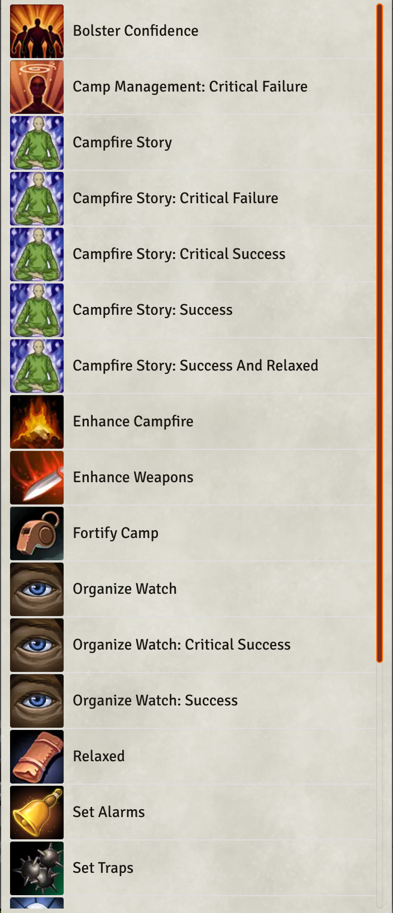

### Meal Effects

All meals that can be dragged onto PCs. Allows you to select favorite meal and degree of success.

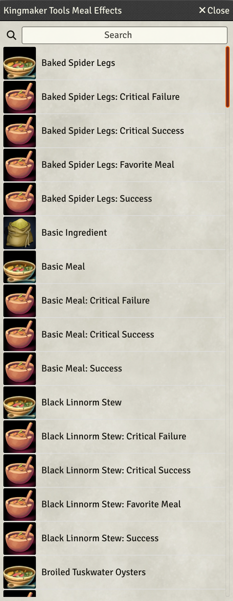

### Structures

**Note**: Images are not included!

Structures are implemented as NPC stat blocks, including the correct sizes. Their description is in the public notes.

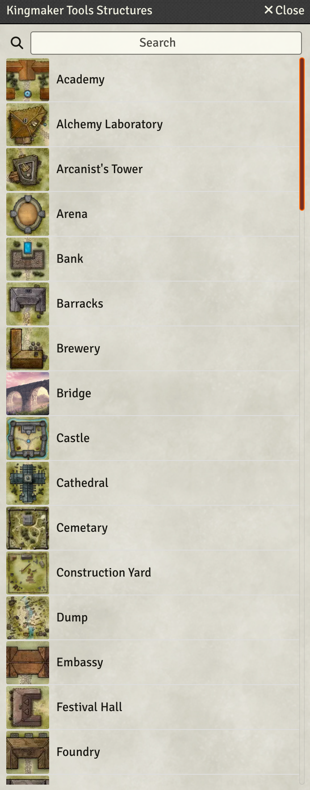

All structures in a settlement can be automatically summed up and calculated by using the **Kingdom Sheet** Macro. 


If you want to home brew structure rules, you can use the **Edit Structure Rules** Macro but be aware, that these **are not considered stable yet and won't be migrated**, so you need to keep up with any changes manually.

A guide on structure rules [is available here](docs/structure-rules.md)

### Daily Weather

Rolls daily weather when your clock advances to a new day, animates weather on maps and starts playlists. If you prefer rolling manually, turn off auto rolling in the settings and use the provided "Roll Kingmaker Weather" macro.

Visual effects rely on [FxMaster](https://foundryvtt.com/packages/fxmaster).

First configure the **Average Party Level** in settings. This setting is used to re-roll weather events if an event with a level higher than APL+4 is rolled. You need to manually keep this value in sync with your party's level over the course of the game.

In addition, you can configure sound effects that are played for rain, sunny and snowfall by creating playlists with the following names:

* **weather.sunny**
* **weather.rain**
* **weather.snowfall**

Each day, a new value is rolled from the roll table and persisted across all scenes.

### Kingdom Sheet (Alpha)

**NOTE**: this implementation is an alpha and might eat your data or break at any point in time. Keep a digital/physical sheet on the side!


The Kingdom sheet auto calculates almost everything related to kingdom building. You launch it exclusively with the **View Kingdom** Macro. 

On first launch, it copies an actor with the name **Kingdom Sheet** into your actors folder. This actor is used to store the sheet data and can be placed anywhere but you must not change its name.

If you want to give your players access to the sheet, edit the actor's permissions as usually.

In addition, you want to add a settlement scene. To do that, navigate to the tab holding your structures and click **Add Current Scene** in your **Settlements** tab. You need to repeat this for all of your scenes that hold structures.

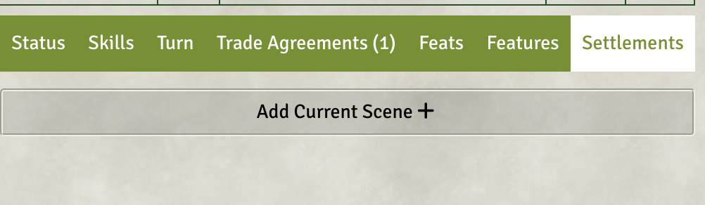


The following variant rules are supported in the settings:

* Always add level to skill for untrained skills
* Double Skill Increases in the Feature Section
* Additional XP and milestones from [Vance and Kerenshara](https://docs.google.com/document/d/1NHksCXkXbjtrv-26VgFHNbyYldatVwag9lM44IWxIXo/edit)

### Homebrew Built-in Changes

* [Based on James Jacob's answers](https://paizo.com/threads/rzs43olf?Kingmaker-Adventure-Path-2E-Errata#19), event XP is bumped to 40XP from 30XP and the event modifier acts as a level modifier for the [XP Awards table](https://2e.aonprd.com/Rules.aspx?ID=575)
* [Based on James Jacob's answers](https://paizo.com/threads/rzs43ogm?How-am-I-misreading-the-camping-rules#3) all camping activities included in the journals are extended to 2 hours.
* Kallike's **Deliberate Planning** activity had its status bonus changed to a circumstance bonus. Reasoning for that is that not a single activity uses a status bonus, it's all circumstance bonuses. Plus a +1 status bonus is obsolete from level 1. 
