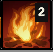
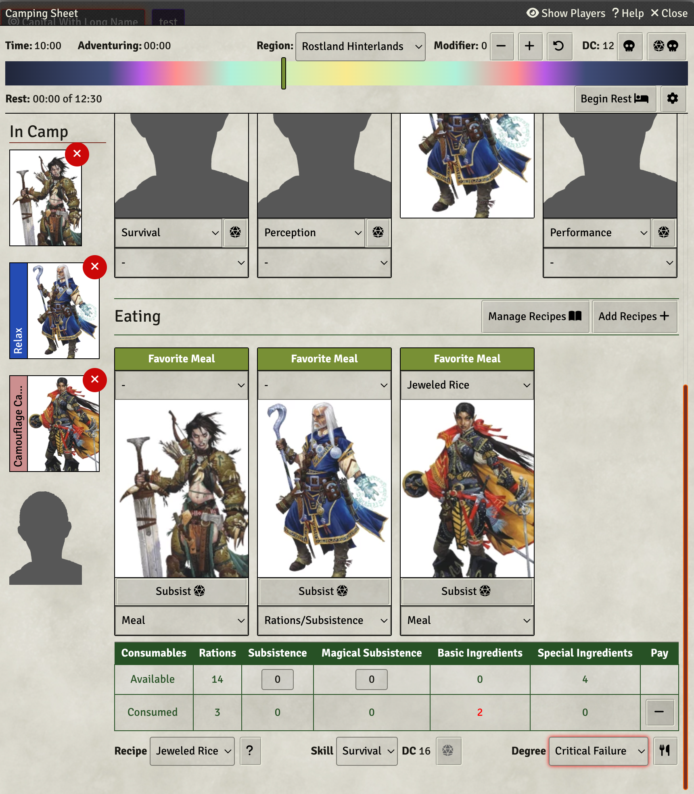
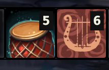

# Kingmaker Tools (Unofficial)

This module ships macros, journal entries, roll tables, effect items, additional tooling for OGL/CUP licensed content
from the Kingmaker Adventure Path for Pathfinder 2nd Edition.

Uses the [Open Gaming License](./OpenGameLicense.md) and [CUP](https://paizo.com/community/communityuse)

> This FoundryVTT module uses trademarks and/or copyrights owned by Paizo Inc., used under Paizo's Community Use
> Policy (paizo.com/communityuse). We are expressly prohibited from charging you to use or access this content. This
> FoundryVTT module is not published, endorsed, or specifically approved by Paizo. For more information about Paizo Inc.
> and Paizo products, visit paizo.com.

## Installation

The package is available through the [module registry](https://foundryvtt.com/packages/pf2e-kingmaker-tools)

### Git

Clone this repository into your installation's module folder:

    cd ~/.local/share/FoundryVTT/Data/modules
    git clone https://github.com/BernhardPosselt/pf2e-kingmaker-tools.git 
    yarn install
    yarn run build

If your Foundry instance is running, you need to restart it to clear its module cache.

Run the following before packaging once and set your paths:

    ./node_modules/.bin/fvtt configure
    ./node_modules/.bin/fvtt configure set installPath /home/bernhard/dev/FoundryVTT-11.301
    ./node_modules/.bin/fvtt configure set dataPath /home/bernhard/.local/share/FoundryVTT/Data

### Official Kingmaker Module Integration

If you've enabled the official module, the following things are automatically taken care of:

* Token Mappings for all companions and structures except for a few exceptions (see Tokens)
* Weather Sound Effects for rain, rain storms, blizzard and snow
* Default and Region combat tracks
* Rolltable integration for:
    * Kingdom Events
    * Random Encounters

If you are not running the official module, check out
the [Kingmaker Tools Token Mapping](https://github.com/BernhardPosselt/pf2e-kingmaker-tools-token-mapping) module

### Camping Sheet

Since 0.2.0, this module ships a camping sheet which includes all meals and camping activities. You can launch the sheet
with the camping macro:

Once run the macro, it will ask you to import an actor to store your camping sheet data on.

If you want to give your players access to the sheet, edit the actor's permissions as usually.

The camping sheet does the following:

* Gives players a way to select camping activities & make skill checks
* Automates all camping and meal effects based on their check outcomes
* Allows you to add custom recipes and activities
* Takes care of calculating and adding/subtracting rations and ingredients based on the chosen recipes
* Allows you to roll random encounter checks
* Completely automates resting by automatically rolling random encounters, perception checks and running the **Rest for
  the Night** macro for all actors

For more detailed information, consult the **Help** button in the camping sheet's title bar.

**Note**: Syncing camping effects is a very slow process, so if you want to run all companions, create 1 companion
**character** sheet instead of adding all 13 companions

**Note**: Random Encounters can be given a proxy roll table like the one listed
in [The Hexploration](https://2e.aonprd.com/Rules.aspx?ID=1276) rules. If you do, the String value "Creature" indicates
to roll on the region roll table. Leave the proxy table setting blank to roll on the region encounters directly

### Kingdom Sheet

The Kingdom sheet auto calculates almost everything related to kingdom building. You launch it exclusively with the *
*View Kingdom** Macro.

On first launch, it copies an actor with the name **Kingdom Sheet** into your actors folder. This actor is used to store
the sheet data and can be placed anywhere but you must not change its name.

If you want to give your players access to the sheet, edit the actor's permissions as usually.

In addition, you want to add a settlement scene. To do that, navigate to the tab holding your structures and click **Add
Current Scene** in your **Settlements** tab. You need to repeat this for all of your scenes that hold structures.

The following variant rules are supported in the settings:

* Always add level to skill for untrained skills
* Double Skill Increases in the Feature Section
* Additional XP and milestones
  from [Vance and Kerenshara](https://docs.google.com/document/d/1NHksCXkXbjtrv-26VgFHNbyYldatVwag9lM44IWxIXo/edit)

#### Homebrew Built-in Changes

* [Based on James Jacob's answers](https://paizo.com/threads/rzs43olf?Kingmaker-Adventure-Path-2E-Errata#19), event XP
  is bumped to 40XP from 30XP and the event modifier acts as a level modifier for
  the [XP Awards table](https://2e.aonprd.com/Rules.aspx?ID=575)
* [Based on James Jacob's answers](https://paizo.com/threads/rzs43ogm?How-am-I-misreading-the-camping-rules#3) all
  camping activities included in the journals are extended to 2 hours.
* Kalikke's **Deliberate Planning** activity had its status bonus changed to a circumstance bonus. Reasoning for that is
  that not a single activity uses a status bonus, it's all circumstance bonuses. Plus a +1 status bonus is obsolete from
  level 1.

### Structures

**Note**: See **Tokens** for more information on token mappings

Structures are implemented as NPC stat blocks, including the correct sizes. Their description is in the public notes.

All structures in a settlement can be automatically summed up and calculated by using the **Kingdom Sheet** Macro.

If you want to home brew structure rules, you can use the **Edit Structure Rules** Macro but be aware, that these **are
not considered stable yet and won't be migrated**, so you need to keep up with any changes manually.

A guide on structure rules [is available here](docs/structure-rules.md)

### Macros

* A macro to toggle weather on/off to change into non-exposed areas
* A macro to manually roll weather, should you prefer to not automatically roll it.
* A macro to advance/retract to a certain day of time
* A macro to award XP to players and level them up once they cross the XP threshold
* A macro to reset hero points to 1
* A macro to roll on a custom Kingdom Events table. By default, the Roll Table is called "Kingdom Events", but you can
  change the name in the settings
* 3 macros that help automate exploration mode.

2 of them integrate with the new party sheet and will
roll secret checks for stealth and perception for all characters on the current canvas, that have the "Search" or "Avoid
Notice" exploration effect. The other macro rolls checks for all configured characters and can be used to roll checks on
the hex map without having the tokens be active on that scene.

### Tokens

**Note**: This module autoconfigures existing tokens from the official Kingmaker module. If you run your game without
it, you need to install a [separate module](https://github.com/BernhardPosselt/pf2e-kingmaker-tools-token-mapping) and
follow the provided instructions.

**Note**: The official module does not ship Regongar's token. This module links to the expected location, so it should
fix itself automatically once they release an update.

Some tokens are not provided by the official module and you need to gather place these into your *
*Data/pf2e-kingmaker-tools-tokens/** directory under the following paths:

**The Forge**: If you are using The Forge, you need to place the folder in **My Asset Library** instead. If a file is
not found under User Data, The Forge will instead try to look it up under the same path in **My Asset Library** instead.

* **structures/Bridge.webp**
* **structures/Gladiatorial Arena.webp**
* **structures/Magical Streetlamps.webp**
* **structures/Paved Streets.webp**
* **structures/Printing Press.webp**
* **structures/Sewer System.webp**
* **structures/Wall, Stone.webp**
* **structures/Wall, Wooden.webp**

### Companions

Ships the remaining prebuilt companions:

* Jaethal
* Harrim
* Kanerah
* Kalikke
* Octavia
* Regongar

### Journals

The following journals are shipped:

* **Calendar**: lists weekday and month names
* **Camping** Activities: lists all camping activities linked to their respective effects
* **Hexploration**: hexploration rules from AoN enriched with effects and clarifications
* **Influence**: influence activities and a sheet to track points, weaknesses, resistances and biases of each NPC with
  an influence stat block
* **Recipes**: a list of recipes by level linked to their respective effects
* **Kingdom Activities**: All activities

### Daily Weather

Rolls daily weather when your clock advances to a new day, animates weather on maps and starts playlists. If you prefer
rolling manually, turn off auto rolling in the settings and use the provided **Roll Kingmaker Weather** macro or manage
it manually with the **Set Current Weather** macro.

Visual effects rely on the built-in V11 weather effects. This means that all scenes' weather effects will be overridden
by the currently active weather when viewing that scene.

If you want to allow a certain scene to override this behavior,
use the **Scene Weather Settings** macro and disable syncing weather. Note that this will also prevent the usage of the
**Set Current Weather** macro, but you can decide to reuse the weather playlist functionality by enabling **Sync Weather
Playlist** in the scene's weather settings. You can
also set the current scene's weather on the fly through the **Set Current Weather** macro or run the **Toggle Sheltered
from
Weather** macro, which will
disable all weather playlists and weather effects until you turn it back on.

Regarding Weather Events, first configure the **Average Party Level** in settings. This setting is used to re-roll
weather events if an event with
a level higher than APL+4 is rolled. You need to manually keep this value in sync with your party's level over the
course of the game.

In addition, you can configure sound effects that are played by creating playlists with the following names:

* **weather.sunny**
* **weather.rain**
* **weather.snow**
* **weather.fog**
* **weather.blizzard**
* **weather.rainStorm**
* **weather.leaves**

**Note**: If you are using the official module, rain, snow, rainStorm and blizzard are autoconfigured for you, but you
can still override the mechanism by creating the appropriately named playlists

Each day, a new value is rolled from the roll table and persisted across all scenes.

## Combat Tracks

The CRPG ships with various combat tracks that depend on the region (e.g. Narlmarches), scene (e.g. caves, ruins) or
actor (e.g. Vordakai). If Combat Tracks are enabled, it tries to find a playlist in the following order:

* Combat playlist of the first actor with a playlist on the combat tracker (Configurable via **Set Combat Playlist**
  Macro by
  selecting a token)
* Combat playlist of the active scene (Configurable via **Set Combat Playlist** Macro by not selecting a token)
* Combat playlist of the current region (e.g. **Kingmaker.Rostland Hinterlands**)
* Combat playlist called **Kingmaker.Default**

If any playlist is found, at the start of combat, that playlist is played and the active scene's playlist is disabled.
Afterward, the games active scene's playlist is started again.

If you wish to quickly disable combat tracks, e.g. when fighting a boss, you can use the **Toggle Combat Tracks** Macro.

**Note**: If you are using the official module, the default and region combat tracks are autoconfigured for you, but you
can still
override the mechanism by creating the appropriately named playlists

