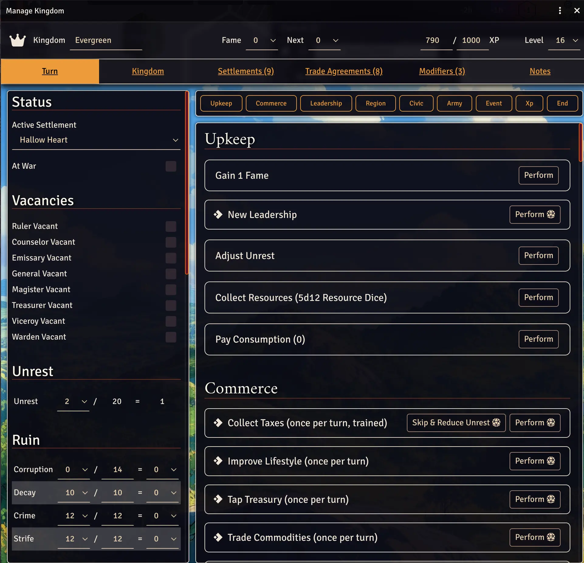
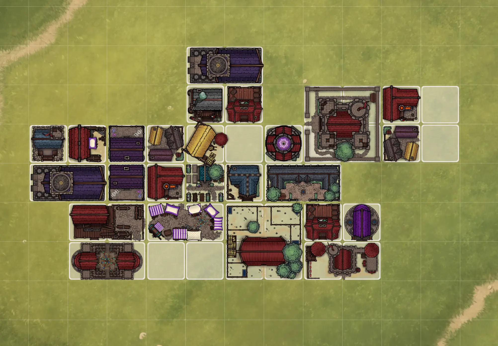
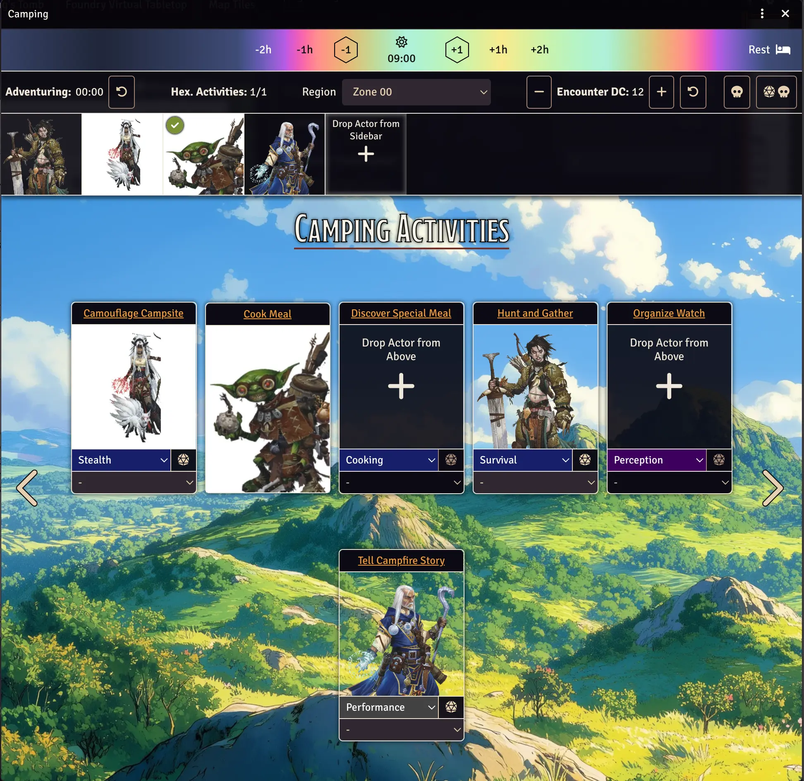
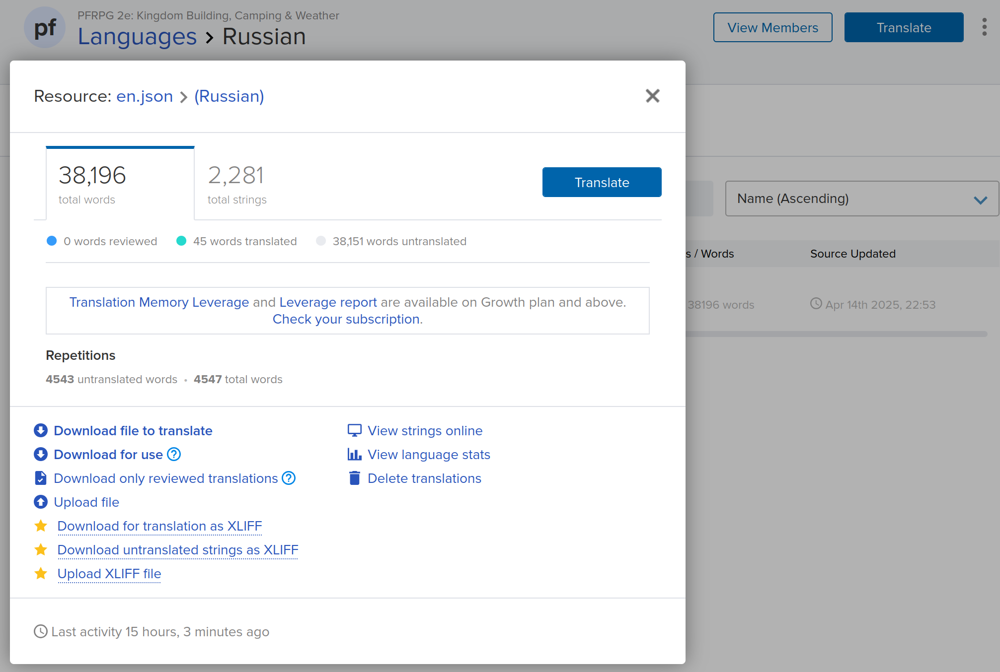

# PFRPG 2e: Kingdom Building, Camping & Weather

This module ships all OGL licensed rules to run the Kingdom, Camping and Weather rule systems for the most popular adventure for PFRPG 2e.

**Documentation is included in a journal inside FoundryVTT!**

## Licensing

All PFRPG 2e content uses the [Open Gaming License](./OpenGameLicense.md). If you find non OGL content, please file an
issue and I'll get it removed ASAP. I've tried my best to scrub existing content, but there might still be leftovers.

The source code is licensed under the AGPLv3 license, except for
the [src/jsMain/kotlin/com/foundryvtt](./src/jsMain/kotlin/com/foundryvtt) folder which is licensed
under [Apache License 2.0](./src/jsMain/kotlin/com/foundryvtt/LICENSE).

All images in the [img/structures](./img/structures),  [img/kingdom/backgrounds](./img/kingdom/backgrounds) and [img/camping/backgrounds](./img/camping/backgrounds) are
licensed under [CC0 - Public Domain](https://creativecommons.org/publicdomain/zero/1.0/)
by [Mark Pearce](https://github.com/MarkPearce). They
were [generated and retouched using a MidJourney subscriber account](https://github.com/BernhardPosselt/pf2e-kingmaker-tools/issues/76).
According to their [Terms of Service](https://docs.midjourney.com/docs/terms-of-service), subscribers to MidJourney that
are not part of a company own all the generated images.

All images in [img/settlements/backgrounds](./img/settlements/backgrounds) are
licensed under [CC0 - Public Domain](https://creativecommons.org/publicdomain/zero/1.0/)
by dbavirt on Discord.

## Installation

The package is available through the [module registry](https://foundryvtt.com/packages/pf2e-kingmaker-tools)

## Functionality

This module ships with implementations for all the extra mechanics provided in the best sandbox PFRPG 2e adventure,
including optional and popular homebrew from Vance & Kerenshara:

* Camping Sheet
* Kingdom Sheet
* Weather
* Combat Tracks

### House Rules & GM Tips

You can look up my tips and house rules [here](./docs/house-rules.md)

### Official Module Integration

If you've enabled the official module, the following things are automatically taken care of:

* Token Mappings for all companions and structures
* Weather Sound Effects for rain, rainstorms, blizzard and snow
* Default and Region combat tracks
* Rolltable integration for:
    * Kingdom Events
    * Random Encounters
    * Cult Events

### Screenshots







## Development

If you are interested in hacking on the code base, take a look at the [Kotlin JS Primer](./docs/Kotlin%20JS%20Primer.md)
for a quick intro on how to interact with the js api.

I highly recommend [IntelliJ Idea Ultimate or IntelliJ Community Edition](https://www.jetbrains.com/idea/download/?section=linux)

Community Edition is free while Ultimate offers better integration. Scroll down a bit to find the Community Edition download link.

### Windows Setup

Make sure you have FoundryVTT installed, and that you've launched it at least once to ensure all directories are created properly.

Install the following things:

* [git](https://git-scm.com/downloads/win) (pick all the default options)
* [node](https://nodejs.org/en/download) click the green button named **Windows Installer (.msi)**
* [JDK 21](https://adoptium.net/installation/) launch a Windows terminal and paste the following:

      winget install EclipseAdoptium.Temurin.21.JDK

Then, restart your PC.

Next, open your file explorer and paste the following path into the URL bar (CTRL + l):

    %localappdata%/FoundryVTT/Data/modules/ 

This will take you to Foundry's modules folder. Inside the folder, right click onto an empty space and click **Open Git Bash here** (in Windows 11, that option is hidden under **Show more options**).

From now on, all commands will be run via the Git Bash instead of the Windows terminal.

Paste (right click -> paste) the following command into the Git Bash to install yarn:

    npm install --global yarn

Then, download the code (if you are more well versed with Windows, you can probably also clone the code somewhere else and create a symlink):

    git clone https://github.com/BernhardPosselt/pf2e-kingmaker-tools.git 

The folder **pf2e-kingmaker-tools** should now exist. Change into it:

    cd pf2e-kingmaker-tools

If you **don't have access to Transifex and aren't interested in becoming a translator**, you need to create dummy localization files locally, otherwise the app won't load:

    ./gradlew createDummyTranslations

If you have access to Transifex, log into your Transifex account and retrieve your token from your [account settings page]( https://app.transifex.com/user/settings/api/). Then create your rc file using:

    nano ~/.transifexrc

Paste the following contents and change **TX_TOKEN** to your token

```ini
[https://app.transifex.com]
rest_hostname = https://rest.api.transifex.com
token         = TX_TOKEN
```

Save the file with **CTRL + o**, then exit with **CTRL + x**.

Pull all translation files using:

    ./gradlew txPull

Then compile the application using:

    ./gradlew assemble

Now open FoundryVTT. The module should be listed as installed. You will need to run the **assemble** command again each time you change a file, git pull or pull  translations from Transifex

You can pull the latest changes inside the folder using:

    git pull

### Linux & macOS Setup

Install the following things using your package manager or homebrew:

* JDK 21
* git
* node
* yarn

Ubuntu:

    sudo apt install nodejs git openjdk-21-jdk
    sudo npm install --global yarn

Arch:

    sudo pacman -S nodejs git jdk21-openjdk yarn

macOS:

    brew install --cask temurin@21
    brew install git node@22 yarn

Then restart your machine for the JVM changes to take effect.

First, create a folder to clone the repository into:

    mkdir dev
    cd dev

Then, clone the repository:

    git clone https://github.com/BernhardPosselt/pf2e-kingmaker-tools.git

Then link this directory to your foundry data folder:

Linux:

    ln -s /home/$(whoami)/dev/pf2e-kingmaker-tools/ /home/$(whoami)/.local/share/FoundryVTT/Data/modules/pf2e-kingmaker-tools/

macOS:

    ln -s /Users/$(whoami)/dev/pf2e-kingmaker-tools/ /Users/$(whoami)/Library/Application Support/FoundryVTT/Data/modules/pf2e-kingmaker-tools/

If you **don't have access to Transifex and aren't interested in becoming a translator**, you need to create dummy localization files locally, otherwise the app won't load:

    ./gradlew createDummyTranslations

If you have access to Transifex, you need to pull all language files from Transifex where TX_TOKEN is obtained from your [account settings page]( https://app.transifex.com/user/settings/api/). Create your rc file using:

    nano ~/.transifexrc

Paste the following contents and change **TX_TOKEN** to your token

```ini
[https://app.transifex.com]
rest_hostname = https://rest.api.transifex.com
token         = TX_TOKEN
```

Save the file with **CTRL + o**, then exit with **CTRL + x**.

Pull all translation files using:

    ./gradlew txPull

Then compile the application using:

    ./gradlew assemble

or if you want to both build it and run its tests:

    ./gradlew build

To execute tests run:

    ./gradlew jsTest

Finally, start Foundry.

You can release a new version by changing the version in **build.gradle.kts** and then executing:

    GITHUB_TOKEN="token_here" FOUNDRY_TOKEN="token_here" ./gradlew release

### Enable Schema Autocompletion Support in IntelliJ

Some files are in JSON rather than actual code. To get autocompletion for these in IntelliJ, you need to enable custom
schemas.

In settings, go to **Languages & Frameworks > Schemas and DTDs > JSON Schema Mappings**.

Click on the + to add a new mapping for each schema. Then add the following (see a list of values further down below):

* **Name**: Name of the Schema
* **Schema file or URL**: Path to the Schema file in [./schemas/](./schemas/)
* **Schema Version**: Always **JSON Schema version 7**
* Then click on the **+** below and **Directory**

Example:

* : Recipes:
    * **Name**: Recipes
    * **Schema file or URL**: schemas/recipes.json
    * **Directory**: data/recipes

## Translations

### Help out as a Translator

If you want to help translating this module as a Translator open an issue on GitHub with your email and language or contact me on Discord, so I can send you an invite to the project on Transifex.

Don't edit the files in **lang/** directly. Every file except for **en.json** will be overridden by changes from Transifex. Instead, edit the translations in Transifex.

You can pull changes either by setting up the project locally (check out the relevant Setup section above!):

    ./gradlew txPull
    ./gradlew assemble

or by manually downloading by clicking on your language in Transifex and choosing **Download for use**  Then place the downloaded file into **Data/modules/pf2e-kingmaker-tools/dist/lang/ru.json** (adjust name depending on your translation). The location of the data folder [depends on your Operating System](https://foundryvtt.com/article/user-data/). However, make sure to only perform this **on your local dev instance and not on your hosted services due to security reasons**: translations might include malicious HTML and those strings are only stripped when building the project.

### Help out as a Developer

This module skips the built-in Foundry translation system since it's broken and unusable. Nonetheless, you need to link your json files in the module.json file for each language, otherwise Foundry will not let you change your language in the settings.

#### Making Changes in Code

Translations are persisted in **lang/en.json**. **DO NOT EDIT other translation files directly since they will be overridden by changes from Transifex**. You can arbitrarily nest JSON values and reference them using the path. For instance: 

```json
{
  "key": {
    "something": "value"
  }
}
```

would be referenced using **key.something**. Translations can be parameterized:

```json
{
  "key": {
    "something": "{greeting} to you"
  }
}
```

Plurals can be translated using [ICU](https://unicode-org.github.io/icu/userguide/format_parse/messages/) (with **coins** being passed as an int parameter):

```json
{
  "key": {
    "something": "He paid {coins, plural, =0 {nothing} =1 {one coin} =other{# coins}} for his groceries"
  }
}
```

It's also possible to use different translations based on a parameter, e.g. gender (with **gender** being passed as either "male" or "female"; other is the catchall case):

```json
{
  "key": {
    "something": "{gender, select, female {She} male {He} other {They}} went to the party"
  }
}
```

There are 2 places where you can translate strings:

In Kotlin code:

```kt
// single value
t("key.something")
// values with context
t("key.something", recordOf("greeting" to "hello"))
```

In Handlebars templates:

```handlebars
{{localizeKM "key.something"}}
{{localizeKM "key.something" greeting="hello"}}
```

#### Pushing Changes

Strings are not edited in the repository. Instead, they are pushed to Transifex first, edited and then pulled.

After you've made your changes in **lang/en.json**, you need to push it to your translators using:

    ./gradlew txPush
