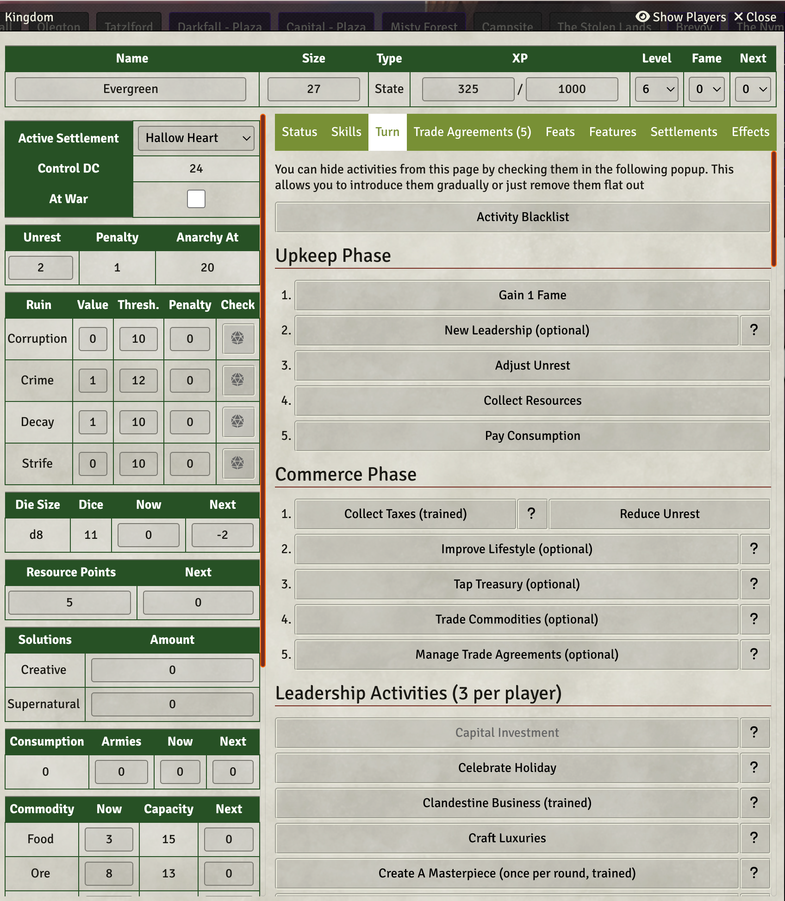

# PFRPG 2e: Kingdom Building, Camping & Weather

This module ships all OGL licensed rules to run the Kingdom, Camping and Weather rule systems for the most popular
adventure for PFRPG.

## Licensing

All PFRPG 2e content uses the [Open Gaming License](./OpenGameLicense.md). If you find non OGL content, please file an
issue and I'll get it removed ASAP. I've tried my best to scrub existing content, but there might still be leftovers.

The source code is licensed under the AGPLv3 license, except for
the [src/jsMain/kotlin/com/foundryvtt](./src/jsMain/kotlin/com/foundryvtt) folder which is licensed
under [Apache License 2.0](./src/jsMain/kotlin/com/foundryvtt/LICENSE).

All images in the [img/structures](./img/structures) and [img/camping/backgrounds](./img/camping/backgrounds) are
licensed under [CC0 - Public Domain](https://creativecommons.org/publicdomain/zero/1.0/)
by [Mark Pearce](https://github.com/MarkPearce). They
were [generated and retouched using a MidJourney subscriber account](https://github.com/BernhardPosselt/pf2e-kingmaker-tools/issues/76).
According to their [Terms of Service](https://docs.midjourney.com/docs/terms-of-service), subscribers to MidJourney that
are not part of a company own all the generated images.

## Installation

The package is available through the [module registry](https://foundryvtt.com/packages/pf2e-kingmaker-tools)

## Functionality

This module ships with implementations for all the extra mechanics provided in the best sandbox PFRPG 2e adventure,
including optional and popular homebrew from Vance & Kerenshara:

* Camping Sheet
* Kingdom Sheet
* Weather
* Combat Tracks

### House Rules & GM Tips

You can look up my tips and house rules [here](./docs/house-rules.md)

### Official Module Integration

If you've enabled the official module, the following things are automatically taken care of:

* Token Mappings for all companions and structures except for a few exceptions (see Manual journal)
* Weather Sound Effects for rain, rainstorms, blizzard and snow
* Default and Region combat tracks
* Rolltable integration for:
    * Kingdom Events
    * Random Encounters
    * Cult Events

### Screenshots

## Development

If you are interested in hacking on the code base, take a look at the [Kotlin JS Primer](./docs/Kotlin%20JS%20Primer.md)
for a quick intro on how to interact with the js api.

### Setup

Install the following things:

* JDK 21
* git
* node
* yarn

First, clone the repository into a local folder, e.g. **/home/bernhard/dev**:

    cd /home/bernhard/dev
    git clone https://github.com/BernhardPosselt/pf2e-kingmaker-tools.git 

Then link this directory to your foundry data folder:

    ln -s /home/bernhard/dev/pf2e-kingmaker-tools/ /home/bernhard/.local/share/FoundryVTT/Data/modules/pf2e-kingmaker-tools/

Run the package task to build everything from scratch:

    ./gradlew package

Then, you can keep building the project using:

    ./gradlew assemble

or if you want to both build it and run its tests:

    ./gradlew build

To execute tests run:

    ./gradlew jsTest

Finally, start foundry

    cd dev/FoundryVTT-12.330/
    ./foundryvtt

You can release a new version using:

    GITHUB_TOKEN="token_here" FOUNDRY_TOKEN="token_here" ./gradlew release

### Enable Schema Autocompletion Support in IntelliJ

Some files are in JSON rather than actual code. To get autocompletion for these in IntelliJ, you need to enable custom
schemas.

In settings, go to **Languages & Frameworks > Schemas and DTDs > JSON Schema Mappings**.

Click on the + to add a new mapping for each schema. Then add the following (see a list of values further down below):

* **Name**: Name of the Schema
* **Schema file or URL**: Path to the Schema file in [./schemas/](./schemas/)
* **Schema Version**: Always **JSON Schema version 7**
* Then click on the **+** below and **Directory**

Schemas:

* Recipes:
    * **Name**: Recipes
    * **Schema file or URL**: schemas/recipes.json
    * **Directory**: data/recipes
* Structures:
    * **Name**: Structures
    * **Schema file or URL**: schemas/structures.json
    * **Directory**: data/structures
* Camping Activities:
    * **Name**: Camping Activities:
    * **Schema file or URL**: schemas/camping-activities.json
    * **Directory**: data/camping-activities